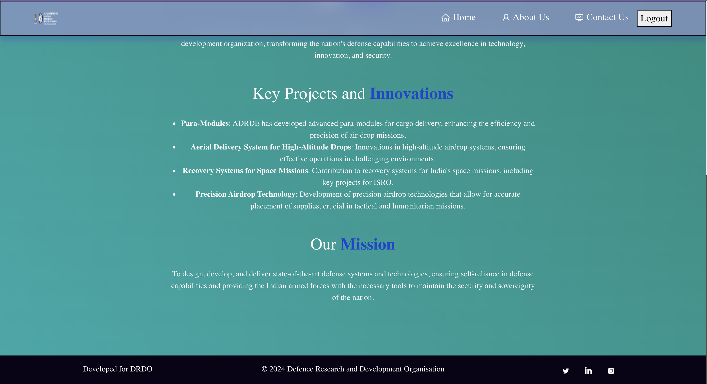
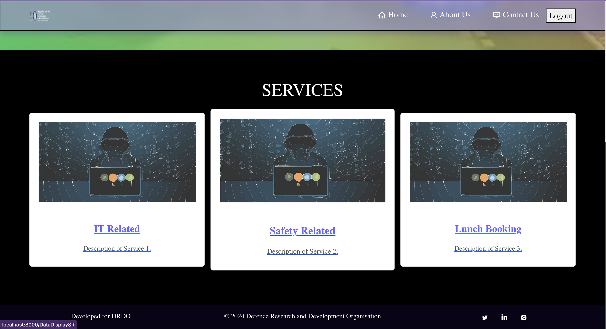

# Online Requirement Portal

The Online Requirement Portal is an application built using React, Firebase Realtime Database, Tailwind CSS, Bootstrap, etc., designed to facilitate various services within DRDO (Defense Research and Development Organization). It includes functionalities such as managing IT-related services, safety management, and lunch booking orders from employees to the GD of the organization.

## Features

- **IT Related Services**: Manage IT equipment and services requests.
- **Safety Management**: Ensure safety protocols and manage safety-related requests.
- **Lunch Booking**: Enable employees to book their lunches conveniently.

## Technologies Used

- **Frontend**: React, Tailwind CSS, Bootstrap
- **Backend**: Firebase Realtime Database
- **Authentication**: Firebase Authentication
- **Deployment**: Firebase Hosting

## Getting Started

### Prerequisites

- Node.js (v14.x or higher)
- npm (Node Package Manager)

### Clone the Repository

```bash
git clone https://github.com/your-username/online-requirement-portal.git
cd online-requirement-portal
```


### Screenshots






[](Screenshots/scrnrcd01.mp4)
[](Screenshots/scrnrcd01.mp4)
